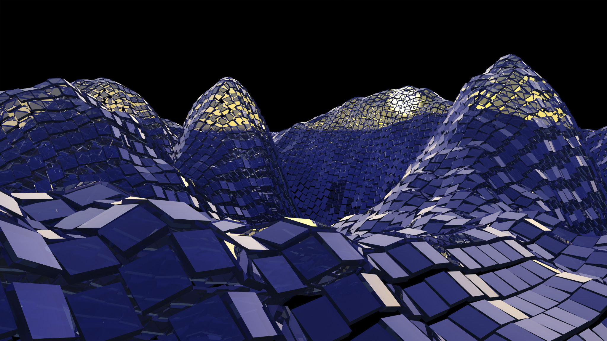

# DMcTools

Graphics tools by David K. McAllister

Written and maintained continuously from 1995-2022 by David McAllister

DMcTools is my collection of graphics tools - matrix class, image loading and saving, 3D vector math, random numbers, timer, 3D model loader, Morton codes, Hilbert sequence, octahedral mapping, image filtering, high-dimensional vectors, nonlinear optimization, etc.

Projects that use DMcTools:

* https://github.com/davemc0/GenArt.git
* https://github.com/davemc0/ClothDemo.git
* https://github.com/davemc0/Particle.git
* https://github.com/davemc0/IMgFix.git

This code is implemented in C++. I originally developed it on Linux, but I've only run it on Windows lately. This code works great on Visual Studio 2019 with C++17. I hope it will build on Linux or Mac straightforwardly.

I'm happy to discuss these tools, to receive code contributions, bug fixes, or bug fix requests.

Building the Library
--------------------

Generally I place DMcTools/ in a folder adjacent to, not inside of, the project that depends upon it. I then build that project using CMake, which builds and includes DMcTools. See the above projects that use it for examples of how their CMakeLists.txt file does it.
